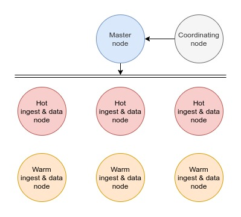

# OpenSearch - Docker - Compose


Dockerized cluster architecture for OpenSearch with compose.

## Key concepts

- OpenSearch is [the successor of OpenDistro](https://opendistro.github.io/for-elasticsearch/blog/2021/06/forward-to-opensearch/)
- OpenSearch = Elasticsearch
- OpenSearch Dashboards = Kibana

## Cluster setup

Raise your host's ulimits for ElasticSearch to handle high I/O :

```bash
sudo sysctl -w vm.max_map_count=512000
# Persist this setting in `/etc/sysctl.conf` and execute `sysctl -p`
```

Now, we will generate the certificates for the cluster :

```bash
# You may want to edit the OPENDISTRO_DN variable first
bash generate-certs.sh
```

Start the cluster :

```bash
docker-compose up -d
```

Wait about 30 seconds and run `securityadmin` to initialize the security plugin :

```bash
docker-compose exec os01 bash -c "chmod +x plugins/opensearch-security/tools/securityadmin.sh && bash plugins/opensearch-security/tools/securityadmin.sh -cd config/opensearch-security -icl -nhnv -cacert config/certificates/ca/ca.pem -cert config/certificates/ca/admin.pem -key config/certificates/ca/admin.key -h localhost"
```

> Find all the configuration files in the container's `/usr/share/opensearch/config/opensearch-security` directory. You might want to [mount them as volumes](https://opendistro.github.io/for-elasticsearch-docs/docs/install/docker-security/).

Access OpenSearch Dashboards through [https://localhost:5601](https://localhost:5601)

Default username is `admin` and password is `admin`

> Take a look at [OpenSearch's internal users documentation](https://opensearch.org/docs/security-plugin/configuration/yaml/) to add, remove or update a user.

## Hot-warm architecture setup

Use a [hot-warm cluster architecture](https://opensearch.org/docs/latest/opensearch/cluster/#advanced-step-7-set-up-a-hot-warm-architecture) if you have data that you rarely want to update or search so you can place them on lower-cost storage nodes.

<center>
    
</center>

<details>
<summary>Hot-warm architecture cluster setup instructions...</summary>
<br>

Raise your host's ulimits for ElasticSearch to handle high I/O :

```bash
sudo sysctl -w vm.max_map_count=512000
# Persist this setting in `/etc/sysctl.conf` and execute `sysctl -p`
```

Now, we will generate the certificates for the cluster :

```bash
# You may want to edit the OPENDISTRO_DN variable first
bash generate-certs-hot-warm.sh
```

Adjust `Xms/Xmx` parameters and start the cluster :

```bash
docker-compose -f docker-compose.hot-warm.yml up -d
```

Wait about 60 seconds and run `securityadmin` to initialize the security plugin :

```bash
docker-compose exec os01 bash -c "chmod +x plugins/opensearch-security/tools/securityadmin.sh && bash plugins/opensearch-security/tools/securityadmin.sh -cd config/opensearch-security -icl -nhnv -cacert config/certificates/ca/ca.pem -cert config/certificates/ca/admin.pem -key config/certificates/ca/admin.key -h localhost"
```

> Find all the configuration files in the container's `/usr/share/opensearch/config/opensearch-security` directory. You might want to [mount them as volumes](https://opendistro.github.io/for-elasticsearch-docs/docs/install/docker-security/).

Access OpenSearch Dashboards through [https://localhost:5601](https://localhost:5601)

Default username is `admin` and password is `admin`

> Take a look at [OpenSearch's internal users documentation](https://opensearch.org/docs/security-plugin/configuration/yaml/) to add, remove or update a user.

</details>

To add an index to a warm node :

```jsn
PUT newindex
{
  "settings": {
    "index.routing.allocation.require.temp": "warm"
  }
}
```

You might want to use [Index State Management (ILM)](https://opensearch.org/docs/latest/im-plugin/index/) to automatically move old indices from _hot_ to _warm_ nodes.

## Why OpenSearch

- Fully open source (including plugins)
- Fully under Apache 2.0 license
- Advanced security plugin (free)
- Alerting plugin (free)
- Allows you to [perform SQL queries against ElasticSearch](https://opendistro.github.io/for-elasticsearch-docs/docs/sql/)
- Maintained by AWS and used for its cloud services
